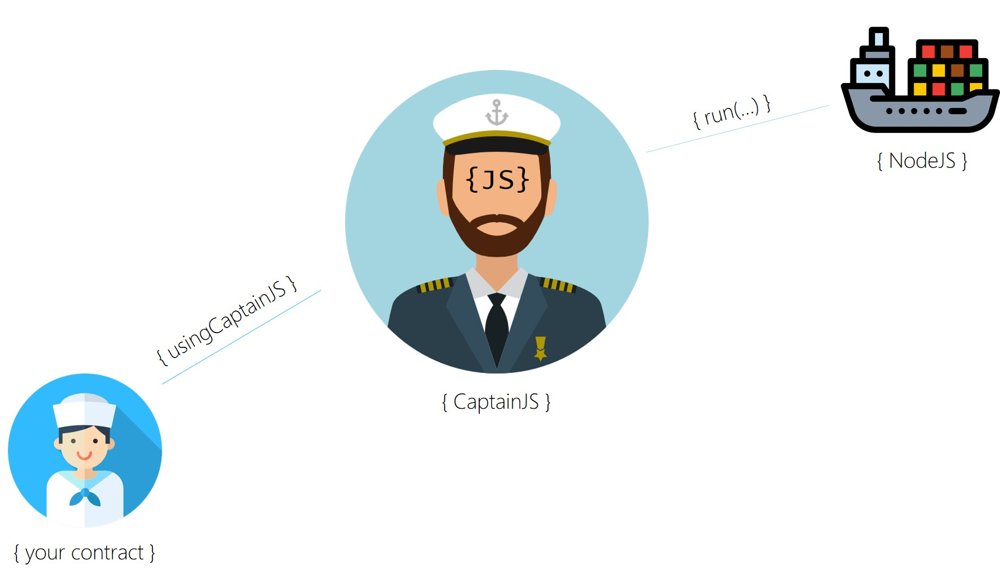

## The Captain's Mess



There are so many Ethereum Oracles out there. But I needed a more simple and straight forward one for my projects. Thus, I created my own one. 
Hi, **I'm CaptainJS** and my nodejs container ship just left the harbor. **Be my Seaman** and start invoking JavaScript directly from Ethereum's Solidity. Here's how to do it...  

### Voucher Codes

There's both a ROPSTEN and MAINNET version available. Both are equal. Inside your **_usingCaptainJS_** there is a voucher context included. Just add your voucher code by calling **_ActivateVoucher_** from your derived Solidity code. 

Just check Captain's Twitter account for vouchers. 

```Solidity
 function UseVoucher() public {
        ActivateVoucher("MobyDick");
 }
```

### Fees & Budget Transfer
The Captain just rented his container ship. To pay his ship he needed to set these prices. Prices may change over time and will be updated both here + via Twitter.

+ _**RingShipsBell**(...)_: 
    - if you have a voucher code then you transfer your gas budget for the callback
    - otherwise the full price needs to be payed
    - **_PricePerSubmission_** = _20 szabo_;
    - **_PricePerBellRing_**   = _6 szabo_;
 
```Solidity
        if(HasVoucher) 
            return GasForCallback * GasPriceInWei;
        else
            return PricePerBellRing + PricePerSubmission + (GasForCallback * GasPriceInWei);
```

+ _**Run**(...)_: 
    - if you have a promo code then you transfer your gas budget for the callback
    - otherwise the full price needs to be payed
    - **_PricePerSubmission_** = _20 szabo_;
    - **_PricePerSlice_**      = _50 szabo_; // 1 slice = 10 seconds
 
```Solidity
        if(HasVoucher) 
            return GasForCallback * GasPriceInWei;
        else
            return PricePerSubmission + (RuntimeSlices * PricePerSlice) + (GasForCallback * GasPriceInWei);
```


## The Seaman's Examples

The **_SeamansExamples_** contract contains some code which you will see in the further chapters. There's a demo instance running at Ethereum's mainnet at address _0xfcd53089c3de49fa8c6cc8330cd9f49e84b01cd6_ (ROPSTEN: _0x2c53859c18da0e286161f1649e6a5fdabcb9bb98_) waiting for your tests. 

_(If the contract doesn't have enough budget anymore because too many seamen tested it, then transfer a tiny amount of real / faucet Ether to it)_


### Use Case #1: The Simple Callback (aka "ring the ship's bell")

In some cases it is necessary to have a mechanism to call the contract back. For example a fond which withdraws its budget every year to specific people. But Solidity can't call itself.  

Therefore extend from usingCaptainJS and start coding...

Use a unique integer job Id to identify your callback. Invoke **_RingShipsBell_** with enough gas and receive the callback in method **_RingRing_**. That's it.

To make sure that **_RingRing_** will only be called by the captain himself and not a pirate, add **_onlyCaptainsOrdersAllowed_** to its declaration.

At the moment the captain can only accept bell rings with a **maximum of 48 hours**.

```solidity
contract SeamansExamples is usingCaptainJS {
   ...
   uint constant SHIPS_BELL_RING = 3;

   function CallbackExample() public {
        RingShipsBell(
            SHIPS_BELL_RING, /* give the job a unique ID */
            20, /* minutes from now */ 
            DEFAULT_GAS_UNITS, /* use default gas */
            DEFAULT_GAS_PRICE /* use default gas price */
        );    
    }

    function RingRing(uint UniqueIdentifier) external onlyCaptainsOrdersAllowed {
        // OK. It worked and we got a result
        ...
    }
    
```

### Use Case #2: The Simple JavaScript Job

Now let's look at a simple JavaScript job. JavaScript's _mathjs_ library has multiple useful functions such as _the conversion of centimeter to inch_. 

In order to use this library you need to call the **_Run_** function and hand over the JavaScript code that is necessary to convert centimeters to inch.

The JavaScript code you want to submit must be written the following way:
```JavaScript
module.exports = function(CaptainJSIn) { /* here goes your code */ } 
```
CaptainJS will invoke your code within a container by calling the default function. **_CaptainJSIn_** will contain your inputs of the JavaScript function. Then CaptainJS will return the result of your code.
If your JavaScript code was successful: **_CaptainsResult_** will be invoked. The return result is always a _string_.

If your JavaScript code was not successful _or_ its result couldn't be send back (it failed _or_ there was not enough gas _or_ whatever happened) then **_CaptainsError_** will be invoked.

To make sure that both **_CaptainsResult_** and **_CaptainsError_** will only be called by the captain himself and not a pirate, add **_onlyCaptainsOrdersAllowed_** to its declaration.

A **runtime slice** has a duration of 10 seconds and it includes the download and install of all required npm modules. At the moment 6 runtime slices are the maximum.

Here's the complete code snippet:

```solidity
contract SeamansExamples is usingCaptainJS {
    ...
    uint constant CENTIMETER_JOB = 1;

    function CentimeterToInchExample(string Centimeter) public {
        Run(
            CENTIMETER_JOB,  /* give the job a unique ID */
            /* JavaScript code I want to execute: */
            "module.exports = function(CaptainJSIn) { var math = require('mathjs'); return math.eval(CaptainJSIn + ' cm to inch'); }", 
            Centimeter, /* Input parameter which will result in CaptainJSIn (see above) */
            "mathjs",  /* Nodejs libraries we need */
            /* we need a maximum of 2 runtime slices */
            3, /* we need a maximum of 3 runtime slices */
            DEFAULT_GAS_UNITS, /* use default gas units */ 
            DEFAULT_GAS_PRICE /* we will transfer the default gas price for return */
        );    
    }

    function CaptainsResult(uint UniqueJobIdentifier, string Result) external onlyCaptainsOrdersAllowed {
        // analyse the return results
        if(UniqueJobIdentifier == CENTIMETER_JOB) {
            // OK. It worked and we got a result
            ...
        } else 
        
        if(UniqueJobIdentifier == WOLFRAMALPHA_JOB) {
            // OK. It worked and we got another result
            ...
        }
    }
    
    function CaptainsError(uint UniqueJobIdentifier, string Error) external onlyCaptainsOrdersAllowed {
        // analyse the return results
        if(UniqueJobIdentifier == CENTIMETER_JOB) {
            // OK. It didn't work :-/
        }
    }

}    
```

### Use Case #3: The Heavy JavaScript Job

Now let's look at a more complex JavaScript job. You want to ask **WolframAlpha** anything it knows about a country like _France_. Therefore you design your code the same way like you did in **Use Case #2**. 

To query WolframAlpha you use JavaScript's _axios_ library. The default function must be _async_ so that you can wait for a result when you invoke _axios.get(...)_. _axios_ will return a JSON object but we need to flatten it to a _string_:

```JavaScript
module.exports = async function(CaptainJSIn) { 
    const axios = require('axios');
    const WAlpha = await axios.get('http://www.wolframalpha.com/queryrecognizer/query.jsp?appid=DEMO&mode=Default&i=' + CaptainJSIn + '&output=json');          
    return JSON.stringify(WAlpha.data);
}
```
Again, CaptainJS will invoke your code within a container by calling this default function. **_CaptainJSIn_** will contain your inputs such as _"France"_. 

Again, if your JavaScript code was successful: **_CaptainsResult_** will be invoked. Otherwise **_CaptainsError_** will be invoked.

And because Solidity sometimes is such a crappy programming language you will use a very expensive **_concat_** function to make your JavaScript code more readable. 

Here's the complete code snippet. 

```solidity
contract SeamansExamples is usingCaptainJS {
    ...
    uint constant WOLFRAMALPHA_JOB = 2;
    
    function WolframAlphaExample(string Country) public {
        Run(
            WOLFRAMALPHA_JOB, /* give the job a unique ID */            
            concat ( /* JavaScript code I want to execute: */
                "module.exports = async function(CaptainJSIn) { ",
                "   const axios = require('axios'); ",
                "   const WAlpha = await axios.get('http://www.wolframalpha.com/queryrecognizer/query.jsp?appid=DEMO&mode=Default&i=' + CaptainJSIn + '&output=json'); ",          
                "   return JSON.stringify(WAlpha.data); ",
                "}"
            ),
            Country, /* Input parameter which will result in CaptainJSIn (see above) */
            "axios, mathjs", /* Nodejs libraries we need */
            3, /* we need a maximum of 3 runtime slices */
            200000, /* use 200,000 gas units */
            DEFAULT_GAS_PRICE /* use default gas price */
        );    
    }
      
    ...
}    
```


### Use Case #4: The JSON, XML/XPath or HTML/jQuery Request

A classic oracle request is a simple JSON, XML/XPath or HTML/jQuery request. Instead of writing a full-blown JavaScript code which does the query for you the newest release has predefined queries.

To invoke a simple query just use the _Run_ method in the same way as you did it in the previous 2 use cases. But instead of submitting JavaScript code send an URL that has either a **_html:_**, **_xml:_** or **_json:_** prefix. The input parameter of the _Run_ method is either a _JSON_, _XPath_ or _jQuery_ expression. Typically 1 runtime slice is enough.

_(The client libraries now include a test module to see if your code works - before you submitted to the blockchain)_

```
    function HTMLqueryExample() public {
        Run(
            HTML_QUERY_EXAMPLE,  /* give the job a unique ID */
            /* url needs to start with html: */
            "html:http://www.amazon.co.uk/gp/product/1118531647",
            /* Input parameter is the jQuery. Result will be stored in QUERY_RESULT variable */ 
            "$('span.inlineBlock-display span.a-color-price').each(function(i, element) {var el = $(this); QUERY_RESULT = el.text(); })", 
            "",  /* no modules required */
            1, /* queries are fast */
            DEFAULT_GAS_UNITS, /* use default gas units */ 
            DEFAULT_GAS_PRICE /* we will transfer the default gas price for return */
        );    
    }
    
    function JSONqueryExample() public {
        Run(
            JSON_QUERY_EXAMPLE,  /* give the job a unique ID */
            /* url needs to start with json: */
            "json:https://api.kraken.com/0/public/Ticker?pair=ETHUSD",
            /* Input parameter is the JSON path */ 
            "result.XETHZUSD.a[0]", 
            "",  /* no modules required */
            1, /* queries are fast */
            DEFAULT_GAS_UNITS, /* use default gas units */ 
            DEFAULT_GAS_PRICE /* we will transfer the default gas price for return */
        );    
    }
```


### What If? 

+ _what if_ you don't transfer enough **gas**?
    - then your job won't fail directly.
    - the captain will try his best to get the job back on the blockchain
    - he will calculate the budget you submitted when calling **_Run(...)_** as _budget = 350000 * max possible gas_price_
    - if your job result then still doesn't go through, then good night
    
+ _what if_ you transfer too much **gas** and a too high **gas price**?
    - then the captain will order a bottle of rum on your expense
    
+ _what if_ it a callback is delayed (ie. it is invoked after 2 days instead of 2 hours)
    - the captain then will argue that the concept of blockchain isn't made for exacted invocations
    - be mentally prepared then
    - transfer a higher budget next time by increasing **gas** and **gas price**
    
+ _what if_ a JavaScript code never gets executed?
    - relax
    - the captain then will shout "**impossible!**" and try its best by informing you via **_CaptainsError_** invocati### What If? 

+ _what if_ you change code within **_usingCaptainJS_**?
    - you won't be keelhauled :-)
    - try it, improve it!

+ _what if_ you submit _bad_ code?
    - we don't like pirates!
    - this is not nice!


### Client Libraries
I uploaded a JavaScript test client at https://github.com/CaptainJavaScript/Seaman-Client


